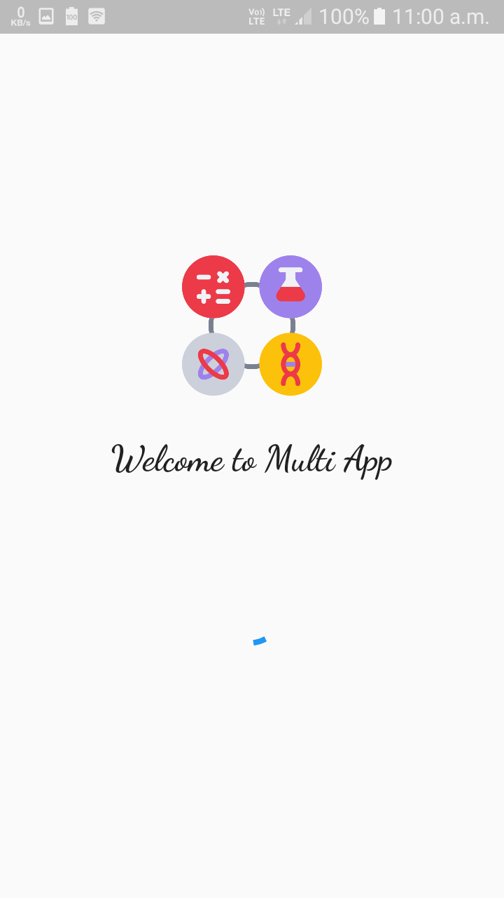
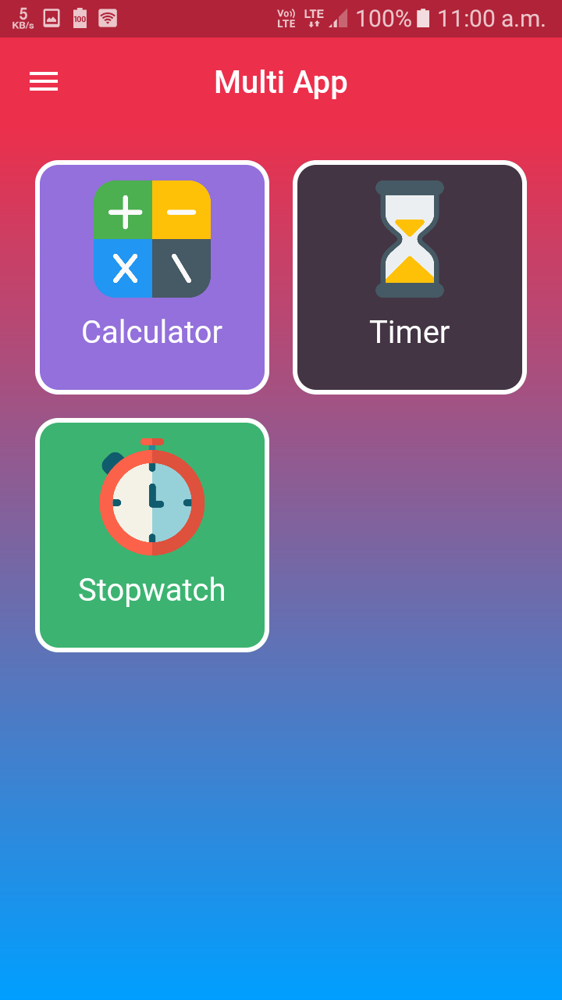
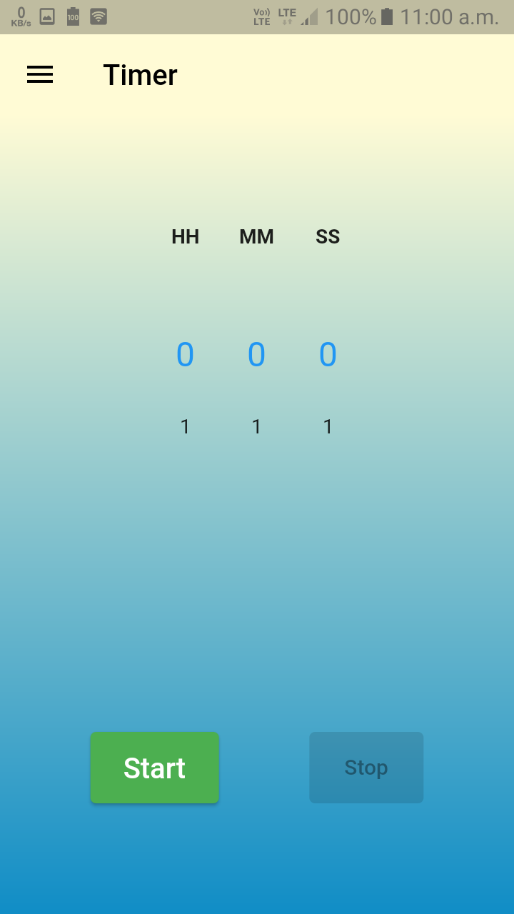
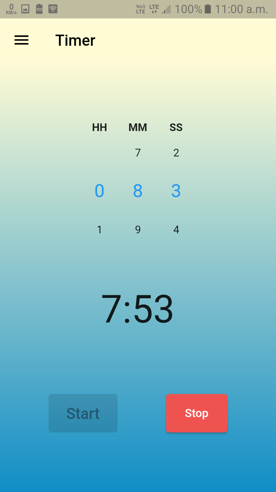
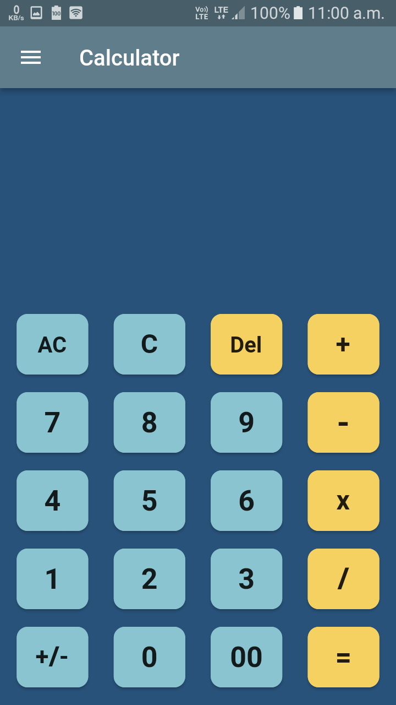
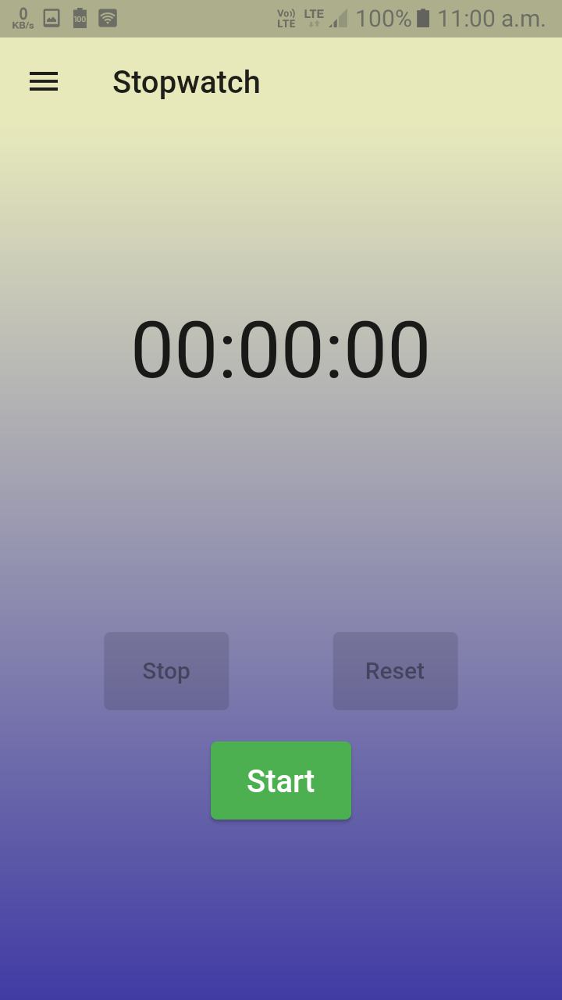

# This was my First Flutter App

A old Flutter project.

## :camera:Screenshots

|<table>
  <tr>
  <th>Splash Screen</th>
  <th>Home Page</th>
  </tr>
  <tr>
  <td>
  </td>
  <td>
  </td>   
  <tr>
  <th>Timer Page</th>
  <th>Timer Page (Running)</th>
  </tr>
  </tr>
   <tr>
  <td>
  </td>
  <td>
  </td>   
  </tr>
  <tr>
  <th>Calculator Page</th>
  <th>Stopwatch Page</th>
  </tr>
  <tr>
  <td>
  </td>
  <td>
  </td>   
  </tr>
</table>
